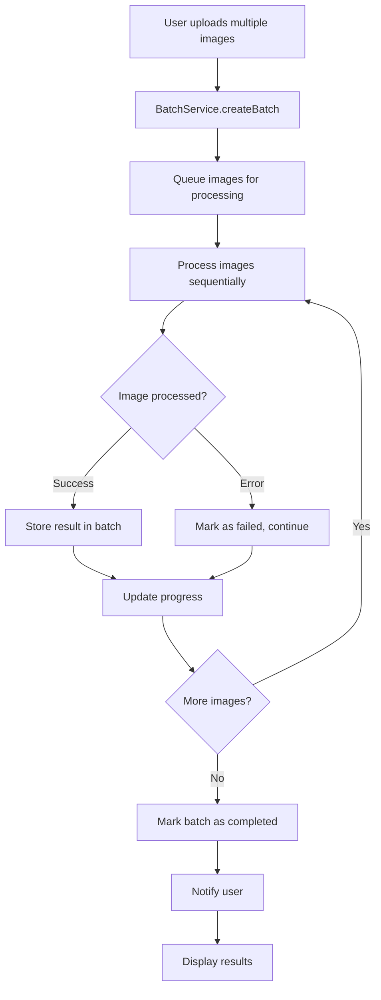
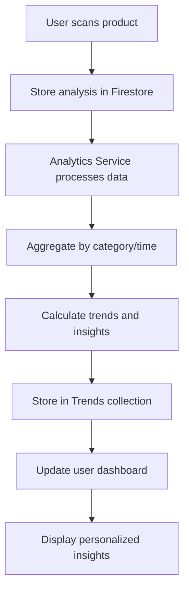
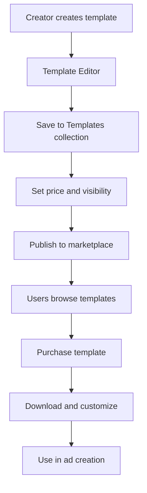

# Werkaholic AI - Erweiterte Architektur und Feature-Plan

## Aktuelle Kernfunktionalität (Analyse)

**Werkaholic AI** ist eine KI-gestützte Werbeanalyse-App für Kleinanzeigen mit folgenden Kernfeatures:

### Bestehende Features:
- **Einzelbild-Analyse**: Gemini AI analysiert Bilder von Gegenständen und generiert Verkaufsdaten
- **Datenextraktion**: Titel, Preis, Zustand, Kategorie, Beschreibung, Keywords, Features, Defects
- **Marketplace**: Verwaltung und Anzeige analysierter Produkte
- **Vergleichsmodus**: Vergleich von bis zu 4 Produkten (Premium: unbegrenzt)
- **Historie**: Speicherung aller Analysen in Firebase
- **Subscription-System**: Free/Pro-Modell mit Scan-Limits
- **Multi-Plattform-Publishing**: Export zu verschiedenen Verkaufsplattformen
- **Authentifizierung**: Firebase Auth
- **PWA**: Progressive Web App mit Offline-Fähigkeiten

### Technischer Stack:
- **Frontend**: React + TypeScript + Vite
- **Backend**: Firebase (Auth, Firestore, Hosting)
- **AI**: Google Gemini 2.5 Flash
- **Styling**: Tailwind CSS + Custom Components
- **State Management**: React Context
- **Build**: Vite

## Identifizierte Lücken und Verbesserungsmöglichkeiten

### Kritische Lücken:
1. **Batch-Analyse**: Nur Einzelbilder können analysiert werden
2. **Trend-Analyse**: Keine Markttrends oder Preisverfolgung
3. **Marketplace-Limitierungen**: Nur eigene Produkte, keine Templates oder Community-Features
4. **Monetarisierung**: Begrenzte Premium-Features, schwache Conversion

### Verbesserungspotenziale:
1. **Performance**: Caching-System vorhanden, aber kann erweitert werden
2. **UX**: Onboarding und Feature-Discovery können verbessert werden
3. **Analytics**: Keine Nutzerdaten-Analyse für Produktverbesserungen
4. **Social Features**: Keine Community oder Sharing-Features

## Neue Feature-Designs

### 1. Batch-Analyse Feature

**Ziel**: Mehrere Bilder gleichzeitig analysieren für effiziente Massenverarbeitung.

**Funktionen**:
- Drag & Drop für multiple Bilder (bis zu 20)
- Fortschrittsanzeige mit individuellen Status pro Bild
- Bulk-Operationen: Alle bearbeiten, alle exportieren, alle löschen
- Priorisierung: Kritische Bilder zuerst verarbeiten
- Fehlerbehandlung: Einzelne Fehler stoppen nicht den gesamten Batch

**UI-Komponenten**:
- BatchUploadModal mit Drag-Zone
- ProgressDashboard mit Live-Updates
- BatchResultsView mit Filter- und Sortieroptionen

**Technische Implementierung**:
- Queue-System für sequentielle API-Calls
- Web Workers für parallele Verarbeitung
- IndexedDB für temporäre Speicherung großer Batches

### 2. Trend-Analyse Feature

**Ziel**: Markttrends und Preisverfolgung basierend auf aggregierten Nutzerdaten.

**Funktionen**:
- **Preis-Trends**: Durchschnittspreise pro Kategorie über Zeit
- **Saisonale Analysen**: Preisschwankungen nach Jahreszeit
- **Markt-Insights**: Beliebte Kategorien, durchschnittliche Verkaufszeiten
- **Persönliche Trends**: Eigene Verkaufserfolge vs. Markt

**Datenquellen**:
- Aggregierte anonymisierte Nutzerdaten
- Eigene Historie für personalisierte Insights
- Externe Marktdaten (optional Integration)

**Visualisierung**:
- Interaktive Charts mit Filteroptionen
- Heatmaps für Kategorie-Popularität
- Zeitreihen für Preisverfolgung

### 3. Erweiterter Marketplace

**Ziel**: Von reinem Produkt-Management zu umfassender Verkaufsplattform.

**Neue Features**:
- **Template-Marktplatz**: Vorgefertigte Anzeigen-Templates
- **Premium-Templates**: Hochwertige, optimierte Templates
- **Community-Features**: Template-Sharing, Bewertungen, Kommentare
- **Template-Editor**: Drag & Drop Template-Builder
- **Kategorie-spezifische Templates**: Optimierte Templates pro Plattform/Kategorie

**Monetarisierung**:
- Freemium: Basis-Templates kostenlos, Premium kostenpflichtig
- Template-Verkäufe: Nutzer können eigene Templates verkaufen
- Kommission auf Verkäufe durch Template-Nutzung

### 4. Verbessertes Freemium-Modell

**Aktuelles Modell**:
- Free: 10 Scans/Monat, Basis-Features
- Pro: Unbegrenzte Scans, erweiterte Features

**Neues Modell**:
- **Free Tier**: 5 Scans/Monat, Batch-Analyse (max 3 Bilder), Basis-Marketplace
- **Pro Tier** (9.99€/Monat): Unbegrenzte Scans, Batch-Analyse (unbegrenzt), Trend-Analyse, Premium-Templates
- **Business Tier** (19.99€/Monat): Alle Pro-Features + API-Zugang, White-Label, Prioritätssupport

**Conversion-Optimierung**:
- Progressive Feature-Locks
- Nutzungsbasierte Upgrades
- A/B-Testing für Preise
- Referral-Programm

## Systemarchitektur

### Datenmodell-Erweiterungen

```typescript
// Erweiterte Typen für neue Features
interface BatchAnalysis {
  id: string;
  userId: string;
  images: BatchImage[];
  status: 'pending' | 'processing' | 'completed' | 'failed';
  progress: number;
  createdAt: string;
  completedAt?: string;
}

interface BatchImage {
  id: string;
  file: File;
  status: 'queued' | 'processing' | 'completed' | 'failed';
  result?: AdAnalysis;
  error?: string;
}

interface Template {
  id: string;
  title: string;
  description: string;
  category: string;
  platform: string;
  content: TemplateContent;
  price: number;
  creatorId: string;
  rating: number;
  downloads: number;
  tags: string[];
}

interface MarketTrend {
  category: string;
  period: 'daily' | 'weekly' | 'monthly';
  avgPrice: number;
  priceChange: number;
  volume: number;
  topKeywords: string[];
  seasonality: SeasonalData;
}

interface UserAnalytics {
  userId: string;
  totalScans: number;
  successfulSales: number;
  avgSalePrice: number;
  topCategories: string[];
  scanFrequency: number;
  conversionRate: number;
}
```

### API-Architektur

```
Frontend (React/TypeScript)
    ↓
Service Layer
├── GeminiService (AI Analysis)
├── BatchService (Batch Processing)
├── TemplateService (Template Management)
├── AnalyticsService (Trend Analysis)
└── MarketplaceService (Product Management)
    ↓
Backend (Firebase)
├── Firestore (Data Storage)
├── Cloud Functions (Business Logic)
├── Cloud Storage (File Storage)
└── Firebase Auth (Authentication)
```

### Workflow-Diagramme

#### Batch-Analyse Workflow


#### Trend-Analyse Pipeline


#### Template-Marketplace Workflow


## Feature-Roadmap

### Phase 1: Foundation (2-3 Wochen)
1. **Batch-Analyse Core**
   - Batch-Upload UI
   - Queue-System implementieren
   - Progress-Tracking

2. **Datenmodell-Erweiterungen**
   - Neue TypeScript-Interfaces
   - Firestore-Schema-Updates
   - Migration-Scripts

### Phase 2: Analytics & Trends (2-3 Wochen)
1. **Trend-Analyse Backend**
   - Aggregations-Logik
   - Analytics-Service
   - Daten-Pipeline

2. **Trend-Visualisierung**
   - Charts-Komponenten
   - Dashboard-Integration
   - Filter-Optionen

### Phase 3: Marketplace Evolution (3-4 Wochen)
1. **Template-System**
   - Template-Editor
   - Template-Storage
   - Template-Management

2. **Community-Features**
   - Bewertungssystem
   - Kommentare
   - Social Sharing

### Phase 4: Monetarisierung & Optimization (2-3 Wochen)
1. **Neues Subscription-Modell**
   - Preise anpassen
   - Feature-Gating verbessern
   - Conversion-Funnels

2. **Performance & UX**
   - Caching optimieren
   - Onboarding verbessern
   - A/B-Testing einrichten

## Technische Herausforderungen

### Skalierbarkeit
- **AI-API-Limits**: Rate-Limiting und Queue-Management
- **Datenwachstum**: Effiziente Aggregation für Trends
- **Concurrent Users**: Optimierte Caching-Strategien

### Qualitätssicherung
- **AI-Accuracy**: Validierung und Feedback-Loops
- **Data Privacy**: GDPR-konforme Datenspeicherung
- **Error Handling**: Robuste Fehlerbehandlung für Batch-Operationen

### User Experience
- **Performance**: Lazy-Loading und Optimierung für große Batches
- **Mobile UX**: Touch-optimierte Batch-Operationen
- **Accessibility**: Screen-Reader-Support für neue Features

## Erfolgsmetriken

### Business KPIs
- **Conversion Rate**: Free zu Pro Upgrades
- **User Retention**: Monatliche aktive Nutzer
- **Revenue per User**: Durchschnittlicher Umsatz pro Nutzer
- **Template Adoption**: Nutzung von Premium-Templates

### Product KPIs
- **Batch Usage**: Durchschnittliche Batch-Größe
- **Template Creation**: Anzahl erstellter Templates
- **Trend Engagement**: Nutzung der Analytics-Features
- **Scan Volume**: Gesamtanzahl der Analysen

## Risiken und Mitigation

### Technische Risiken
- **API-Dependencies**: Fallback-Strategien für Gemini-Ausfälle
- **Data Migration**: Sichere Migration bestehender Daten
- **Performance Impact**: Monitoring und Optimierung

### Business Risiken
- **Market Competition**: Differenzierung durch einzigartige Features
- **User Adoption**: Graduelle Feature-Rollouts mit A/B-Testing
- **Monetarisierung**: Flexible Pricing-Strategien

Diese Architektur transformiert Werkaholic AI von einem einfachen Analyse-Tool zu einer umfassenden Verkaufsplattform mit KI-gestützten Insights und Community-Features.